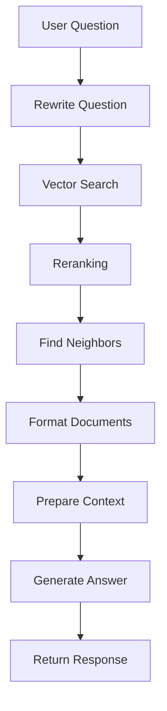

Luồng RAG (Retrieval-Augmented Generation) trong code này có các bước chính sau:

1. **Khởi tạo Components** (trong `__init__` của `QuestionAnsweringChain`):
```python
- LLM Handler (Gemini)
- Vector Database (Qdrant)
- Retriever 
- Reranker (nếu apply_rerank=True)
```

2. **Xử lý Câu hỏi** (trong `create_chain` và `run`):
```python
a. Nhận câu hỏi từ người dùng
b. (Optional) Rewrite câu hỏi nếu apply_rewrite=True
   - Dùng LLM để viết lại câu hỏi rõ ràng hơn
```

3. **Retrieval - Tìm kiếm Documents**:
```python
a. Vector Search
   - Chuyển câu hỏi thành vector
   - Tìm k documents gần nhất trong Qdrant
   
b. (Optional) Reranking nếu apply_rerank=True
   - Lấy k*2.5 documents
   - Dùng Reranker để sắp xếp lại
   - Chọn k documents tốt nhất

c. Find Neighbors
   - Tìm documents lân cận cho mỗi document
   - Kết hợp nội dung các documents
```

4. **Context Preparation**:
```python
a. Format Documents
   - Kết hợp nội dung các documents
   - Trích xuất links

b. Chuẩn bị Context
   - Lấy chat history
   - Kết hợp documents và chat history
```

5. **Generation - Tạo câu trả lời**:
```python
a. Prompt Engineering
   - Đưa context, chat history và câu hỏi vào template

b. LLM Processing
   - Gửi prompt đến Gemini
   - Nhận câu trả lời

c. Post-processing
   - Parse output
   - Lưu vào chat history
```

6. **Trả về Kết quả**:
```python
- Câu trả lời từ LLM
- Các links liên quan từ documents
```

Flow chi tiết:


Các điểm đặc biệt:
1. Có thể tùy chỉnh:
   - Rewrite câu hỏi
   - Rerank documents
   - Số lượng documents (num_docs)
   - Ảnh hưởng của thời gian (date_impact)

2. Xử lý chat history:
   - Lưu 3 messages gần nhất
   - Dùng làm context cho câu hỏi tiếp theo

3. Error handling:
   - Xử lý lỗi ở mỗi bước
   - Vẫn trả về kết quả ngay cả khi một số bước thất bại
